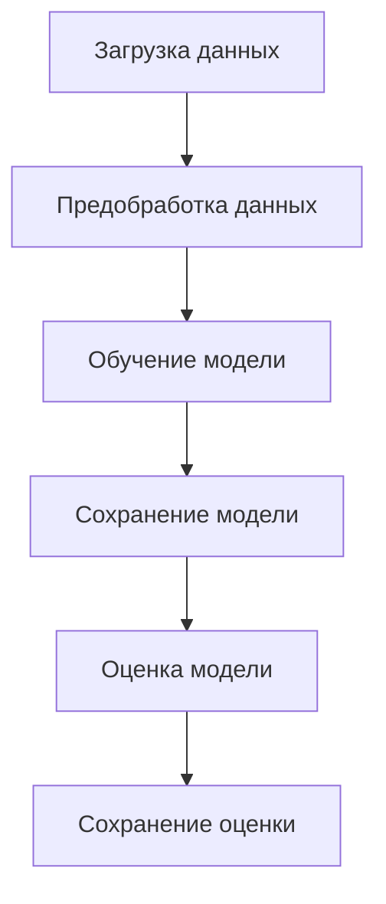
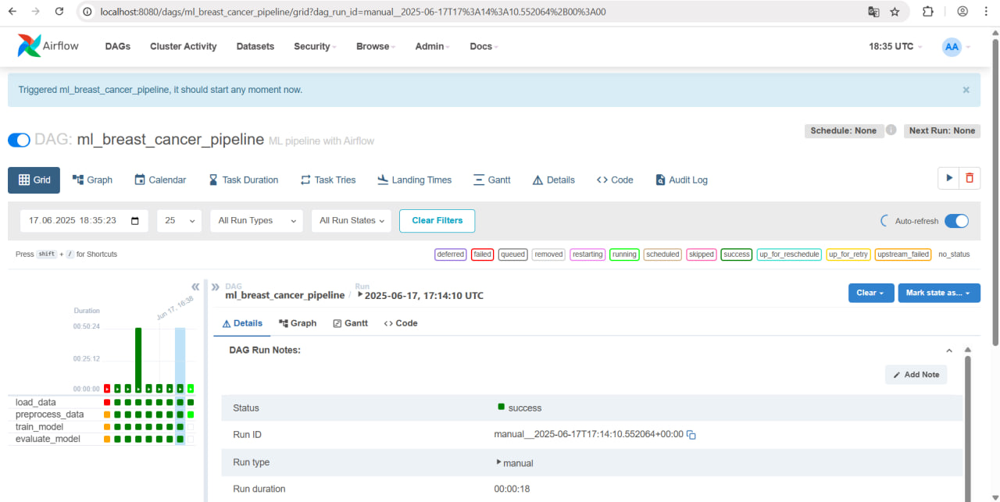
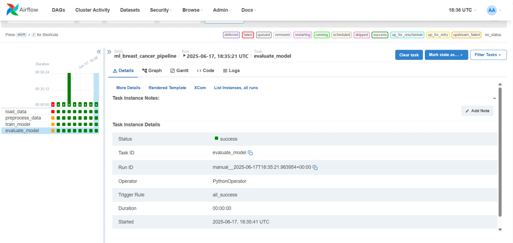
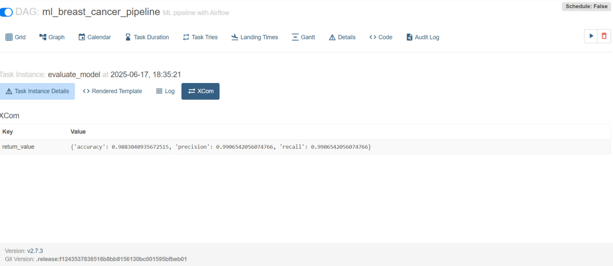
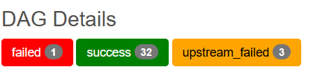

# Pipeline
---
## Содержание
1. [Цель проекта](#цель-проекта)
2. [Архитектура](#архитектура)
3. [Шаги](#шаги-пайплайна)
4. [Инструкция](#инструкция-по-запуску)
5. [Хранилище](#хранилище)
6. [Ошибки](#решение-потенциальных-ошибок)
7. [Идеи](#идеи-для-развития-проекта)
8. [Скриншоты](#скриншоты)
---
## Цель проекта

Спроектировать и реализовать  ETL-процесс: от получения медицинских данных до выгрузки результатов модели в хранилище с помощью Apache Airflow и Python, чтобы автоматизировать и упростить процессы.

---
## Архитектура
```text
pipeline/
├── config
├── dags
│   ├── __pycache__
│   └── de_pipeline_dag.py
├── etl
│   ├── __pycache__
│   ├── __init__.py
│   ├── evaluate_model.py
│   ├── load_data.py
│   ├── preprocess_data.py
│   └── train_model.py
├── logs
│   ├── dag_id=ml_breast_cancer_pipeline
│   ├── dag_processor_manager
│   └── scheduler
├── plugins
├── results
│   ├── metrics.json
│   └── model.pkl
├── .env
├── docker_compose.yaml
├── Dockerfile
└── README.md
 
```

---

## Шаги пайплайна
```text
        -                        -                          -                        -    
|  load_data |    --->  |  preprocess_data  | --->  |  train_model  | --->  |  evaluate_model  |
        -                        -                          -                        -    
```
Отдельные модули расположены в /etl.

1. **Загрузка данных (load_data.py)**
- Загрузка датасета Breast Cancer из sklearn.
- Сохранение: датасет для работы (X.csv, y.csv) в /tmp.
2. **Предобработка (preprocess_data.py)**
- Разделение полученных на прошлом этапе данных на train/test (70/30) с сохранением стратификации.
- Масштабирование (StandardScaler) X_train, X_test.
- Сохранение: X_train.pkl, X_test.pkl, y_train.csv, y_test.csv /tmp.
3. **Обучение и сохранение модели (train_model.py)**
- Алгоритм: LogisticRegression (sklearn).
- Обучение модели на отмасштабированных данных.
- Сохранение: model.pkl в /results, /tmp.
4. **Оценка модели и сохранение результатов (evaluate_model.py)**
- Метрики: accuracy, precision, recall.
- Оценка модели расчетом метрик.
- Сохранение: metrics.json в /results, /tmp.
- Вывод метрики (для логов).
---
## Инструкция по запуску
1. DAG "ml_breast_cancer_pipeline" в файле de_pipeline_dag.py.
2. Запуск Airflow: docker-compose up --build.
3. Веб-интерфейс: localhost:8080.
---
## Хранилище
- Модель и метрики сохраняются в локальное хранилице /results.
- Введение через Docker volumes.
---
## Решение потенциальных ошибок
- Если в начале таска (в 1) при загрузке данных источник данных окажется недоступен, то в качестве механизма защиты предусмотрен retry(1).
- Если в начале таска (кроме 1) при загрузке данных источник файла окажется недоступен, то в качестве механизма защиты файлы на всех этапах сохраняются и берутся из временной папки tmp.
---
## Идеи для развития проекта
- Интеграция с облачным хранилищем.
- Настройка алертов в мессенджере (например, телеграм).
- Настройка времени задержки и увеличение количества для параметра "retry".
---
## Скриншоты
### В работе

### Завершен

### Проверка корректности выполнения

### Выполненные успешные тесты + тесты для отлова ошибок

